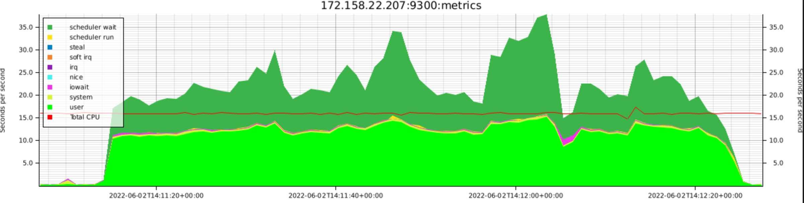
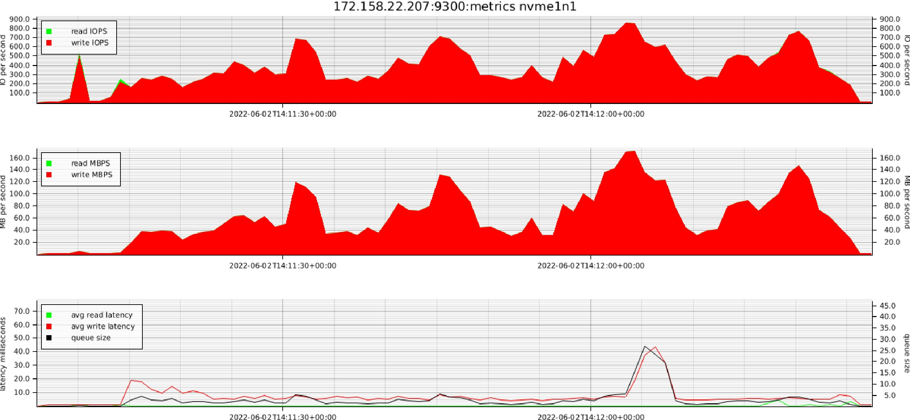
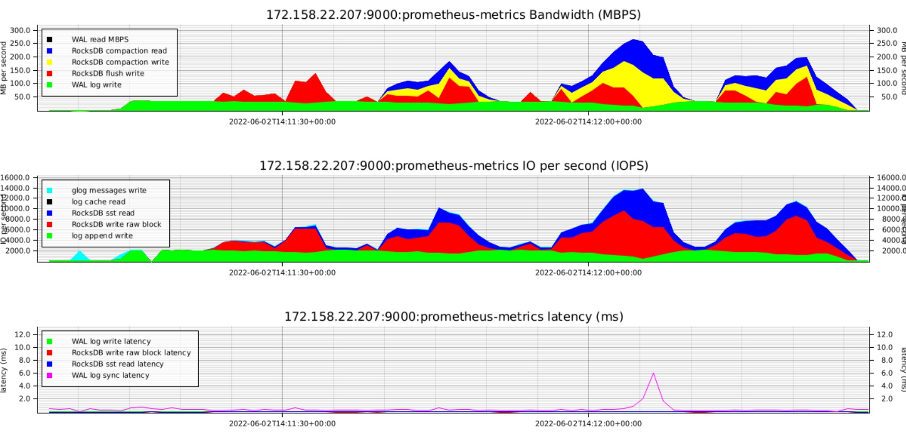

# nodetop

Nodetop is a utility to measure and print detailed data from prometheus (node exporter like) sources at high frequency, such as per 1 second.

The current data that nodetop measures is:
- CPU statistics (from node exporter)
- Disk statistics (from node exporter)
- Yugabyte IO statistics (from YugabyteDB tablet server or master)
 
Nodetop, when executed, will print out the statistics at a 5 seconds interval for all nodes involved to the screen. 
If the switch `--graph` is set, it will create PNG files for CPU, disk and YugabyteIO in the current working directory.

Nodetop performs the exact same purpose as common linux utilities such as sar, iostat and dstat, but doing it for multiple machines.

See `--help` for all the options.

# output
## cpu mode
When `-c` is specified, nodetop shows CPU statistics, such as:
```
hostname                           r     b |      id      us      sy      io      ni      ir      si      st |      gu      gn |  scd_rt  scd_wt |      in      cs |    l_1    l_5   l_15
172.158.22.212:9300:metrics        6     0 |   0.957   0.877   0.060   0.080   0.000   0.000   0.000   0.000 |   0.000   0.000 |   0.957   0.141 |    2700    2086 | 13.040 19.800 11.610
```
Description of the fields:  

| fieldname | description                                                                                                            |
|-----------|------------------------------------------------------------------------------------------------------------------------|  
| hostname  | the hostname or ip address and endpoint                                                                                |
| r         | number of running tasks, alias in task state 'R'                                                                       |
| b         | number of blocked tasks, alias in task state 'D' (tasks in uninterruptible state, meaning: waiting for disk IO)        |
| id        | idle: total time per second idle                                                                                       |
| us        | user: total time per second in user mode                                                                               |
| sy        | system: total time per second in system (kernel) mode                                                                  |
| io        | iowait: total time per second in iowait mode. please note this is an articial, derived, time, which in reality is idle |
| ni        | nice: total time per second in running with an altered nice value                                                      |
| ir        | irq: total time per second in irq mode                                                                                 |
| si        | soft irq: total time per second in soft irq mode                                                                       |
| st        | steal: total time per second 'stolen' (time slices taken by the hypervisor and not executed in this vm)                |
| gu        | guest user: total time per second spent in user mode in a guest (container)                                            |
| gn        | guest nice: total time per second spent in nice mode in a guest (container)                                            |
| scd_rt    | scheduler runtime: total time a task was scheduled for runtime (running on a CPU)                                      |
| scd_wt    | scheduler wait: total time a task set to 'R' (running), but was not yet scheduled on a CPU                             |
| in        | number of interrupts per second                                                                                        |
| cs        | number of context switches per second                                                                                  |
| l_1       | load 1: the load figure for the 1 minute figure                                                                        |
| l_5       | load 5: the load figure for the 5 minute figure                                                                        |
| l_15      | load 15: the load figure for the 15 minute figure                                                                      |

## disk mode
When `-d` is specified, nodetop shows disk statistics, such as:
```
                                                   reads per second           | writes per second          | discards per second        |          | totals per second
hostname                                           merge    io    mb      avg | merge    io    mb      avg | merge    io  sect      avg |    queue |  IOPS  MBPS
172.158.22.212:9300:metrics nvme0n1                    1     0     0 0.000000 |     0     0     0 0.000000 |     0     0     0 0.000000 |    0.000 |     0     0
172.158.22.212:9300:metrics nvme1n1                   18     0     0 0.000000 |     0     6     0 0.000833 |     0     0     0 0.000000 |    0.005 |     6     0
172.158.38.233:9300:metrics nvme0n1                    1     0     0 0.000000 |     0     0     0 0.000000 |     0     0     0 0.000000 |    0.000 |     0     0
172.158.38.233:9300:metrics nvme1n1                   55     0     0 0.000000 |     0     7     0 0.000714 |     0     0     0 0.000000 |    0.005 |     7     0
```
Description of the fields:

| fieldname                  | description                                                                                                   |
|----------------------------|---------------------------------------------------------------------------------------------------------------|
| hostname                   | the hostname or ip address and endpoint                                                                       |
| reads per second: merge    | the number of read calls that got 'merged' (coalesced and physically executed as a single call) per second.   |
| reads per second: io       | the number of read IO requests per second.                                                                    |
| reads per second: mb       | the amount of megabytes of read data per second.                                                              |
| reads per second: avg      | the average time of a read request.                                                                           |
| writes per second: merge   | the number of write calls that goet 'merged' (coalesced and physically executed as a single call) per second. |
| writes per second: io      | the number of write IO requests per second.                                                                   |
| writes per second: mb      | the amount of megabytes of write data per second.                                                             |
| writes per second: avg     | the average time of a write request.                                                                          |
| discards per second: merge | the number of dicards that got 'merged' (coalesced and physically executed as a single call) per second.      |
| discards per second: io    | the number of discard requests per second.                                                                    |
| discards per second: mb    | the amount of megabytes of discarded data per second.                                                         |
| discards per second: avg   | the average time of a discard request.                                                                        |
| queue                      | the average number of IO requests in the disk queue.                                                          |
| totals per second: IOPS    | the total number of IO requests per second.                                                                   |
| totals per second: MBPS    | the total amount of megabytes per second.                                                                     |

Please mind in Centos 7 discards are not implemented, and thus will all show 0, as well as not being available in older versions of node exporter.

## yugabyte mode
When `-y` is specified, nodetop shows yugabyte statistics, such as:
```
hostname                                           msgWinf msgWpri | log WMB log RMB log WIO Wlat ms log RIO lat syn | fls WMB cmp RMB cmp WMB |    rdb RIO Rlat ms    rdb WIO Wlat ms
172.158.22.212:9000:prometheus-metrics                0.00    0.00 |    0.00    0.00    0.00    0.00    0.00    0.00 |       0       0       0 |       0.00    0.00       0.00    0.00
172.158.38.233:9000:prometheus-metrics                0.00    0.00 |    0.00    0.00    0.00    0.00    0.00    0.00 |       0       0       0 |       0.00    0.00       0.00    0.00
172.158.60.183:9000:prometheus-metrics                0.00    0.00 |    0.00    0.00    0.00    0.00    0.00    0.00 |       0       0       0 |       0.00    0.00       0.00    0.00
```
Description of the fields:

| fieldname | description                                                                                                                                                   |
|-----------|---------------------------------------------------------------------------------------------------------------------------------------------------------------|
| hostname  | the hostname or ip address and endpoint                                                                                                                       |
| msgWinf   | messages write IO informal: info logfile writes. info messages are grouped. (glog_info_messages)                                                              |
| msgWpri   | messages write IO priority: warning or error logfile writes. These writes are immediately performed. (glog_warning_messages, glog_error_messages)             |
| log WMB   | WAL log write MBPS: writes to the WAL in megabytes per second. (log_bytes_logged)                                                                             |
| log RMB   | WAL log read MBPS: reads from the WAL in megabytes per second. (log_read_bytes_read)                                                                          |
| log WIO   | WAL log write IOPS: number of writes to the WAL per second. (log_append_latency_count)                                                                        |
| Wlat ms   | WAL log write latency in milliseconds: average write latency. (log_append_latency_sum/log_append_latency_count)                                               |
| log RIO   | WAL log read IOPS: number of reads to the WAL per second. (log_cache_disk_reads)                                                                              |
| lat sync  | latency log file sync: average wait time for log file sync. (log_sync_latency_sum/log_sync_latency_count)                                                     |
| fls WMB   | flush write megabytes: memtable flush writes in megabytes per second. (rocksdb_flush_write_bytes)                                                             |
| cmp RMB   | compaction read megabytes: compaction reads in megabytes per second. (rocksdb_compact_read_bytes)                                                             |
| cmp WMB   | compaction write megabytes: compaction writes in megabytes per second. (rocksdb_compact_write_bytes)                                                          |
| rdb RIO   | rocksdb read IOPS: rocksdb number of read IOs per second. (rocksdb_write_raw_block_micros_count)                                                              |
| Rlat ms   | rocksdb read latency in milliseconds: rocksdb average read latency in milliseconds. (rocksdb_write_raw_block_micros_sum/rocksdb_write_raw_block_micros_count) |
| rdb WIO   | rocksdb write IOPS: rocksdb number of write IOs per second. (rocksdb_sst_read_micros_count)                                                                   |
| Wlat ms   | rocksdb write latency in milliseconds: rocksdb average write latency in milliseconds. (rocksdb_sst_read_micros_sum/rocksdb_sst_read_micros_count)             |

## graph
When the flag `--graph` is specified, nodetop writes a graphics over the total timespan of running of the measurements of cpu, disk and yugabyte statistics in diagrams, this is regardless of the specification of cpu, disk or yugabyte.  

This is an example of a CPU graph:


This is an example of a disk graph:


This is an example of a YugabyteDB graph:


When testing and thus repeated invocation of nodetop, you can use the `--graph-addition` flag to add something to the name of the graphs, so you can generate different graphics that are not overwritten.